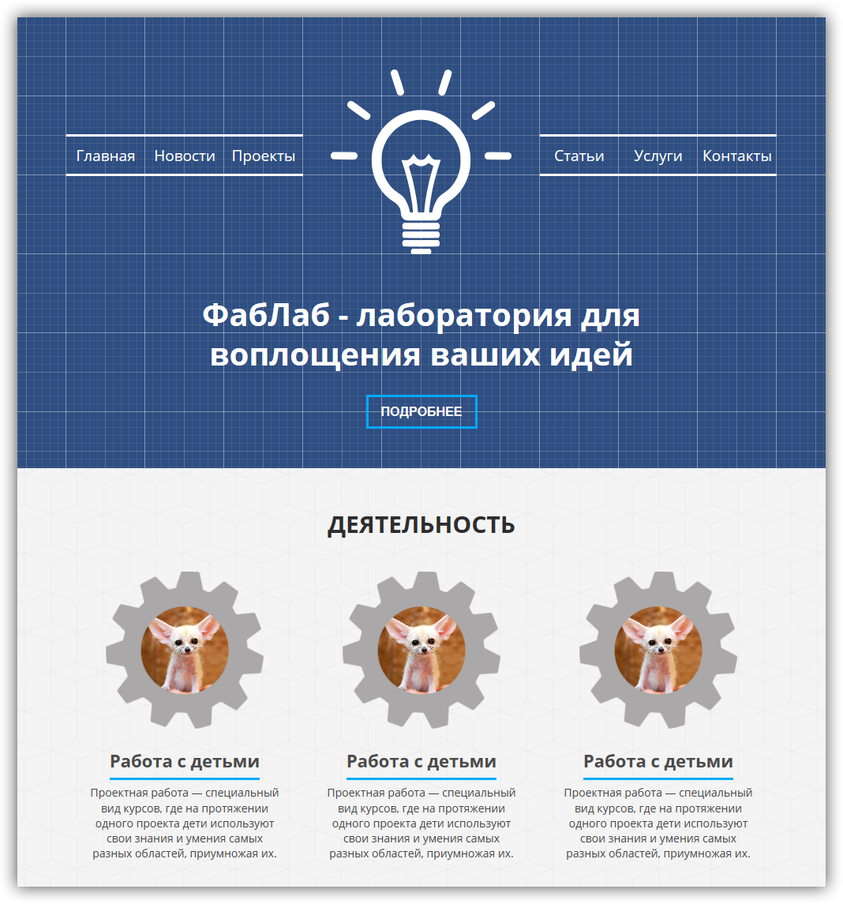

# Fabric

Fabric is a fast, modern and flexible [Grav](http://getgrav.org) theme designed for [FabLab UT](http://new.fablabut.ru) website.

#Installation

To install this theme, just download the zip version of this repository and unzip it under `/user/theme/fabric`.

>> NOTE: This theme is a modular component for Grav which requires the [Grav](http://getgrav.org) CMS, [Error](https://github.com/getgrav/grav-theme-error) and [Problems](https://github.com/getgrav/grav-plugin-problems) plugins.

# Updating

As development for the Fabric theme continues, new versions may become available that add additional features and functionality, improve compatibility with newer Grav releases, and generally provide a better user experience. 

Manually updating Fabric is pretty simple. Here is what you will need to do to get this done:

* Delete the `your/site/user/themes/fabric` directory.
* Download the new version of the Fabric theme from [GitHub](https://github.com/egormkn/grav-plugin-fabric).
* Unzip the zip file in `your/site/user/themes` and rename the resulting folder to `fabric`.
* Clear the Grav cache. The simplest way to do this is by going to the root Grav directory in terminal and typing `bin/grav clear-cache`.

> Note: Any changes you have made to any of the files listed under this directory will also be removed and replaced by the new set. Any files located elsewhere (for example a YAML settings file placed in `user/config/themes`) will remain intact.

## Features

* Lightweight and minimal for optimal performance
* Fully responsive with mobile navigation
* Built-in support for on-page navigation
* Multiple page template types

### Supported Page Templates

* Default view template
* Blog view template
* Error view template
* Blog item view template
* Modular view templates:
  * Features Modular view template
  * Showcase Modular view template
  * Text Modular view template
* SnipCart view template

# Setup

If you want to set Antimatter as the default theme, you can do so by following these steps:

* Navigate to `/your/site/grav/user/config`.
* Open the **system.yaml** file.
* Change the `theme:` setting to `theme: fabric`.
* Save your changes.
* Clear the Grav cache. The simplest way to do this is by going to the root Grav directory in Terminal and typing `bin/grav clear-cache`.

Once this is done, you should be able to see the new theme on the frontend. Keep in mind any customizations made to the previous theme will not be reflected as all of the theme and templating information is now being pulled from the **fabric** folder.
